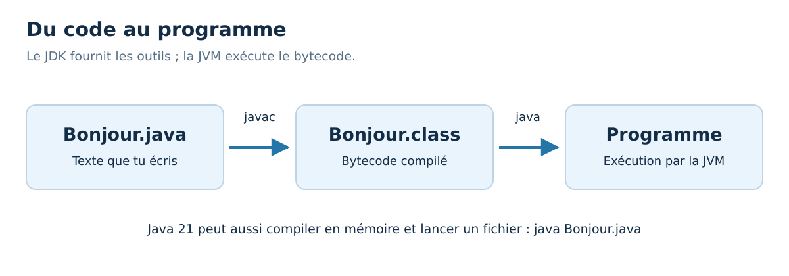

<div align="center">
<h1>☕ 30 Days Of Java : jour 01</h1>
<h3>Installation et premier programme</h3>
<p>Français · Java 21 · Windows &amp; VS Code</p>
</div>

[📚 Sommaire](../README.md) | [Jour 02 →](../02_Day_Variables_and_Types/02_variables_and_types.md)


**Durée conseillée : 60 à 90 min, installation comprise.** Garde au moins une heure ; prends plus de temps pour coder si nécessaire.

📍 [Objectifs](#objectifs) · [Cours](#cours) · [Exemple](#exemple) · [Exercices](#exercices) · [Bilan](#bilan)

<a id="objectifs"></a>
## 🎯 Objectifs du jour

- Installer un JDK et les extensions Java de VS Code sur Windows.
- Exécuter un fichier Java et distinguer le code du résultat.
- Reconnaître le rôle de la classe, de main et de println.

> **Ton rythme :** 10 min de rappel et lecture, 15–20 min sur l’exemple, 30–45 min de pratique, 5 min de bilan. Les jours de projet demandent davantage.

<a id="cours"></a>
# 📘 Cours

## Bienvenue

Tu as déjà écrit du Python : tu sais donc qu'un programme est une suite d'instructions. Nous allons retrouver cette idée en Java, avec une écriture différente et davantage de vérifications avant l'exécution. Tu n'as pas besoin de tout retenir aujourd'hui. Ton premier objectif est concret : **écrire un programme, le lancer, modifier son résultat**.

Java et JavaScript sont deux langages distincts. Ce parcours concerne Java. Il prépare aux fondamentaux souvent rencontrés dans les études : types, algorithmes, méthodes, objets, collections et tests. Trente journées donnent une base à pratiquer ; elles ne remplacent pas tous les exercices de ton établissement.

## Préparer Windows et VS Code

1. Télécharge un **JDK 21** depuis [Eclipse Temurin](https://adoptium.net/temurin/releases/?version=21&os=windows). Choisis Windows, **JDK**, puis l'architecture de ton PC : généralement x64, ARM64 seulement si ton PC est ARM. Dans Windows, le « Type du système » est visible dans **Paramètres → Système → Informations système**. Prends l'installateur `.msi` si proposé.
2. Installe-le en activant l'ajout au `PATH` et la définition de `JAVA_HOME` si l'installateur propose ces options. Le **JDK** contient les outils de développement ; un simple environnement d'exécution ne suffit pas pour toutes les commandes du parcours.
3. Dans [VS Code](https://code.visualstudio.com/), ouvre les extensions avec `Ctrl+Maj+X`. Installe **Extension Pack for Java**, éditeur **Microsoft**, identifiant `vscjava.vscode-java-pack`. Il apporte notamment l'aide à la saisie et le débogueur.
4. Ferme les terminaux déjà ouverts, puis relance VS Code. Ouvre **Terminal → Nouveau terminal**. Les commandes ci-dessous sont à saisir dans **PowerShell**, pas dans un fichier `.java`.

```powershell
java --version
javac --version
```

Les deux commandes doivent afficher la version **21.x** pour suivre exactement cette configuration. Les correctifs peuvent varier. Si ton établissement impose une autre version, garde sa consigne : les exemples du cours n'utilisent aucune fonctionnalité expérimentale. Un JDK plus récent peut exécuter ces exemples.

Si une commande est introuvable, consulte le [guide de dépannage](../docs/INSTALLATION_WINDOWS.md). Si VS Code sélectionne un autre JDK, ouvre `Ctrl+Maj+P`, puis **Java: Configure Java Runtime**. Attention : le Java employé par l'extension et celui de ton terminal peuvent différer.

## Créer ton premier fichier

Crée un dossier `JavaEtudes` dans tes Documents. Dans VS Code, choisis **Fichier → Ouvrir un dossier**, puis ce dossier. Crée `Bonjour.java`, colle l'exemple ci-dessous et enregistre avec `Ctrl+S`. Nomme le fichier exactement comme la classe publique : `Bonjour`, puis l'extension `.java`.

Dans le terminal ouvert dans ce dossier :

```powershell
java .\Bonjour.java
```

Ce mode compile en mémoire puis exécute un fichier source. Pour voir les deux étapes séparément :

```powershell
javac -encoding UTF-8 Bonjour.java
java Bonjour
```

`javac` crée `Bonjour.class`, du **bytecode** que la machine virtuelle Java, la **JVM**, sait exécuter. Dans la seconde commande, on donne le **nom de la classe**, sans extension. Un programme Java n'est donc pas simplement un texte que Windows exécute directement.



## Lire la forme d'un programme

| Écriture | Sens aujourd'hui |
| --- | --- |
| `public class Bonjour` | Déclare la classe publique nommée Bonjour, qui contient notre programme. |
| `{` et `}` | Délimitent un bloc d'instructions. L'indentation le rend lisible. |
| `public static void main(String[] args)` | Point d'entrée conventionnel : Java commence ici. Nous expliquerons ces mots progressivement. |
| `System.out.println(...)` | Affiche une valeur puis passe à la ligne. |
| `;` | Termine ici l'instruction. |
| `// ...` | Commentaire destiné au lecteur, jusqu'à la fin de la ligne. |

Contrairement à Python, l'indentation seule ne délimite pas les blocs. On indente quand même, généralement de quatre espaces, pour comprendre la structure d'un coup d'œil.


<a id="exemple"></a>
## 🔎 Exemple complet, prêt à exécuter

[Ouvrir Bonjour.java](./exemples/Bonjour.java) · [Lire les exercices sans les réponses](./exercices/README.md)

Dans VS Code, ouvre le dossier `exemples` de cette journée, puis lance dans son terminal :

```powershell
java .\Bonjour.java
```

```java
public class Bonjour {
    public static void main(String[] args) {
        // Le texte entre guillemets est affiché tel quel.
        System.out.println("Bonjour Nathan !");
        System.out.println("Je commence Java.");
        System.out.println(2 + 3);
    }
}
```

**Sortie du programme :**

```text
Bonjour Nathan !
Je commence Java.
5
```

### Comprendre le déroulement

Java entre dans `main`, puis exécute les trois affichages de haut en bas. Les guillemets indiquent du texte ; `2 + 3`, sans guillemets, est un calcul. Remplace-le par `"2 + 3"` : tu verras les caractères `2 + 3` au lieu de `5`. Cette distinction entre une valeur et sa représentation écrite reviendra souvent.

Le fichier fourni s’appelle `Bonjour.java`, comme la classe publique de l’exemple.


### ⚠️ Pièges fréquents

- `System` prend une majuscule ; `system` ne désigne pas la même chose.
- Les guillemets courbes d’un traitement de texte ne remplacent pas les guillemets droits `"` du code.
- Enregistre le fichier avant de relancer ; une erreur de compilation se corrige avant de chercher une erreur de calcul.

<a id="exercices"></a>
## 💻 Exercices du jour

Essaie d’abord sans ouvrir les indices. Pour un exercice de code, crée ton propre fichier dans un dossier de travail et donne le même nom à la classe publique et au fichier. Les corrigés sont complets pour permettre une comparaison et une exécution indépendantes.

### Niveau 1 — comprendre et appliquer

#### Exercice 01 — Lire avant de lancer

Sans exécuter, donne le résultat des trois lignes de l’exemple. Puis explique la différence entre `5` et `"5"` dans le code.


<details>
<summary>💡 Voir un indice</summary>

Les deux peuvent être affichés, mais l’un est un nombre et l’autre du texte.

</details>

<details>
<summary>✅ Voir le corrigé détaillé</summary>

Les sorties sont `Bonjour Nathan !`, `Je commence Java.`, puis `5`. `5` est un entier, utilisable directement dans un calcul. `"5"` est une chaîne de caractères. L’affichage identique ne signifie pas que les types sont identiques.


</details>

#### Exercice 02 — Ta carte de présentation

Écris un programme qui affiche ton prénom, puis `Objectif : apprendre Java`, puis le nombre de jours du parcours sur trois lignes.


<details>
<summary>💡 Voir un indice</summary>

Utilise trois appels à `System.out.println`. Le nombre 30 peut être écrit sans guillemets.

</details>

<details>
<summary>✅ Voir le corrigé détaillé</summary>

Chaque appel produit une ligne. Le prénom peut évidemment être remplacé par le tien.


```java
public class Jour01Exercice02 {
    public static void main(String[] args) {
        System.out.println("Nathan");
        System.out.println("Objectif : apprendre Java");
        System.out.println(30);
    }
}
```

[Ouvrir le fichier Java du corrigé](./solutions/Jour01Exercice02.java)

Résultat attendu :

```text
Nathan
Objectif : apprendre Java
30
```

</details>

### Niveau 2 — corriger et consolider

#### Exercice 03 — Réparer une instruction

La ligne `system.out.println("Je teste")` ne compile pas. Repère deux erreurs et écris le programme corrigé.


<details>
<summary>💡 Voir un indice</summary>

Observe la majuscule du premier mot et la fin de l’instruction.

</details>

<details>
<summary>✅ Voir le corrigé détaillé</summary>

Il faut `System` avec une majuscule et un point-virgule final. Le compilateur peut signaler les erreurs successivement : corrige d’abord la première et relance.


```java
public class Jour01Exercice03 {
    public static void main(String[] args) {
        System.out.println("Je teste");
    }
}
```

[Ouvrir le fichier Java du corrigé](./solutions/Jour01Exercice03.java)

Résultat attendu :

```text
Je teste
```

</details>

### Niveau 3 — résoudre un petit problème

#### Exercice 04 — Texte ou calcul ?

Affiche exactement trois lignes : `Mon calcul`, `7 + 8 =`, puis le résultat calculé de 7 + 8. Ne tape pas directement le nombre 15.


<details>
<summary>💡 Voir un indice</summary>

Les deux premières lignes sont du texte ; la troisième doit contenir une expression arithmétique.

</details>

<details>
<summary>✅ Voir le corrigé détaillé</summary>

Le calcul est effectué au moment de l’exécution. On vérifie ainsi que le programme fait le travail demandé au lieu d’afficher un résultat écrit à la main.


```java
public class Jour01Exercice04 {
    public static void main(String[] args) {
        System.out.println("Mon calcul");
        System.out.println("7 + 8 =");
        System.out.println(7 + 8);
    }
}
```

[Ouvrir le fichier Java du corrigé](./solutions/Jour01Exercice04.java)

Résultat attendu :

```text
Mon calcul
7 + 8 =
15
```

</details>

<a id="bilan"></a>
## ✅ Avant de passer à la suite

- [ ] Je peux installer un JDK et les extensions Java de VS Code sur Windows.
- [ ] Je peux exécuter un fichier Java et distinguer le code du résultat.
- [ ] Je peux reconnaître le rôle de la classe, de main et de println.

- [ ] J’ai tenté les quatre exercices avant de comparer aux corrigés.
- [ ] Je peux expliquer une erreur rencontrée et la façon dont je l’ai corrigée.

[Noter ma progression](../PROGRESSION.md) · [Consulter le glossaire](../docs/GLOSSAIRE.md)

### 📎 Pour approfondir

- [Installer Java dans VS Code](https://code.visualstudio.com/docs/java/java-tutorial)
- [Compilation et exécution](https://dev.java/learn/getting-started/)

---

[📚 Sommaire](../README.md) | [Jour 02 →](../02_Day_Variables_and_Types/02_variables_and_types.md)

**☕ Une étape comprise vaut mieux qu’une journée cochée trop vite.**
