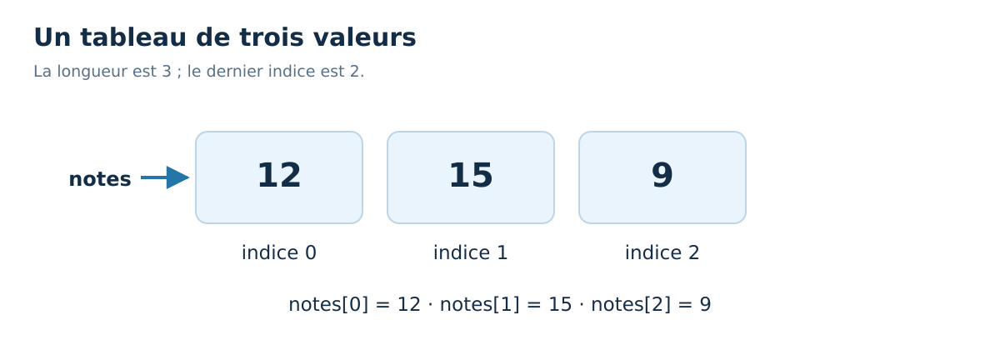

<div align="center">
<h1>☕ 30 Days Of Java : jour 09</h1>
<h3>Tableaux</h3>
<p>Français · Java 21 · Windows &amp; VS Code</p>
</div>

[← Jour 08](../08_Day_For_Loops/08_for_loops.md) | [📚 Sommaire](../README.md) | [Jour 10 →](../10_Day_Methods/10_methods.md)


**Durée conseillée : 60 à 90 min.** Garde au moins une heure ; prends plus de temps pour coder si nécessaire.

📍 [Objectifs](#objectifs) · [Cours](#cours) · [Exemple](#exemple) · [Exercices](#exercices) · [Bilan](#bilan)

<a id="objectifs"></a>
## 🎯 Objectifs du jour

- Créer un tableau de taille fixe.
- Parcourir ses éléments sans dépasser les indices.
- Calculer un total et comprendre une copie de référence.

> **Ton rythme :** 10 min de rappel et lecture, 15–20 min sur l’exemple, 30–45 min de pratique, 5 min de bilan. Les jours de projet demandent davantage.

<a id="cours"></a>
# 📘 Cours

## Plusieurs valeurs du même type

`int[] notes = {12, 15, 9};` crée un tableau de trois entiers. Les crochets font partie du type `int[]`. Les indices vont de 0 à `notes.length - 1`. On lit `notes[0]` et on remplace une case avec `notes[0] = 14;`.

Un tableau a une **taille fixe**. On peut changer ses cases, mais pas ajouter une quatrième case au tableau de longueur trois. Au jour 20, ArrayList répondra au besoin d'une collection qui s'agrandit.

`new int[3]` crée trois cases initialisées à zéro. Les tableaux de boolean commencent à false ; ceux de types objets contiennent initialement null. Cette initialisation des cases ne contredit pas la règle des variables locales : `int x;` ne donne toujours pas une valeur lisible à x dans une méthode.



## Deux façons de parcourir

Utilise une boucle avec indice si tu as besoin de la position ou si tu veux remplacer des cases. La condition habituelle est `i < notes.length`, sans égalité. L'indice `notes.length` est déjà situé après la dernière case.

La boucle améliorée `for (int note : notes)` lit successivement chaque valeur. On peut la lire « pour chaque note dans notes ». Elle est agréable pour calculer une somme. Avec un tableau de int, réaffecter `note` dans cette boucle ne remplace pas la case d'origine : `note` reçoit une copie de sa valeur.

| Besoin | Forme conseillée |
| --- | --- |
| Lire toutes les valeurs | `for (int note : notes)` |
| Modifier une case | `notes[i] = ...` dans une boucle avec indice |
| Connaître la taille | `notes.length`, sans parenthèses |
| Afficher les valeurs en une fois | `Arrays.toString(notes)` |

## Une référence peut être partagée

`int[] autre = notes;` ne copie pas les cases. Les deux variables désignent le **même tableau**. Modifier `autre[0]` change donc ce que tu observes via `notes[0]`. Pour copier les cases d'un tableau de int, utilise `Arrays.copyOf(notes, notes.length)`.

Pour des objets, cette copie resterait superficielle : les références contenues dans les cases seraient copiées, pas les objets eux-mêmes. Nous reviendrons sur cette idée avec les classes.

## Le tableau vide

Un tableau vide est valide et sa longueur vaut zéro. Le parcourir ne fait aucun tour. En revanche, lire sa première case ou diviser une somme par sa longueur pose problème. Avant de calculer une moyenne ou un maximum, définis le comportement prévu quand il n'y a aucune valeur.


<a id="exemple"></a>
## 🔎 Exemple complet, prêt à exécuter

[Ouvrir Jour09Exemple.java](./exemples/Jour09Exemple.java) · [Lire les exercices sans les réponses](./exercices/README.md)

Dans VS Code, ouvre le dossier `exemples` de cette journée, puis lance dans son terminal :

```powershell
java .\Jour09Exemple.java
```

```java
import java.util.Arrays;
public class Jour09Exemple {
    public static void main(String[] args) {
        int[] notes = {12, 15, 9};
        int somme = 0;
        for (int note : notes) {
            somme += note;
        }
        System.out.println(Arrays.toString(notes));
        if (notes.length == 0) {
            System.out.println("Aucune note");
        } else {
            System.out.println("Moyenne : " + (double) somme / notes.length);
        }
    }
}
```

**Sortie du programme :**

```text
[12, 15, 9]
Moyenne : 12.0
```

### Comprendre le déroulement

L'import donne accès à l'utilitaire Arrays. `Arrays.toString` produit un affichage des éléments ; afficher directement `notes` ne le ferait pas. La boucle calcule 36, puis le if vérifie que la division a un sens. Remplace le tableau par `{}` pour observer la branche « Aucune note ».


### ⚠️ Pièges fréquents

- Un tableau utilise `.length`, une String `.length()`, et une ArrayList utilisera `.size()`.
- L’indice de la dernière case est longueur − 1.
- Affecter un tableau à une seconde variable ne duplique pas ses cases.

<a id="exercices"></a>
## 💻 Exercices du jour

Essaie d’abord sans ouvrir les indices. Pour un exercice de code, crée ton propre fichier dans un dossier de travail et donne le même nom à la classe publique et au fichier. Les corrigés sont complets pour permettre une comparaison et une exécution indépendantes.

### Niveau 1 — comprendre et appliquer

#### Exercice 01 — Une copie ou un alias ?

Si a = {1, 2}, puis b = a, puis b[0] = 9, que vaut a[0] ?


<details>
<summary>💡 Voir un indice</summary>

Les variables contiennent ici des références vers un même objet.

</details>

<details>
<summary>✅ Voir le corrigé détaillé</summary>

a[0] vaut 9. On a créé un autre nom pour le même tableau, pas un nouveau tableau.


</details>

#### Exercice 02 — Compter les notes validées

Dans {8, 10, 14, 9, 20}, compte les notes au moins égales à 10.


<details>
<summary>💡 Voir un indice</summary>

Un compteur commence à zéro et augmente seulement quand le critère est vrai.

</details>

<details>
<summary>✅ Voir le corrigé détaillé</summary>

Les trois notes retenues sont 10, 14 et 20.


```java
public class Jour09Exercice02 {
    public static void main(String[] args) {
        int[] notes = {8, 10, 14, 9, 20};
        int validees = 0;
        for (int note : notes) {
            if (note >= 10) {
                validees++;
            }
        }
        System.out.println(validees);
    }
}
```

[Ouvrir le fichier Java du corrigé](./solutions/Jour09Exercice02.java)

Résultat attendu :

```text
3
```

</details>

### Niveau 2 — corriger et consolider

#### Exercice 03 — Modifier chaque case

Ajoute 1 à chaque case du tableau {10, 12, 15}. Utilise une boucle avec indice et affiche le tableau.


<details>
<summary>💡 Voir un indice</summary>

Une variable de parcours int dans une boucle for-each n’est pas la case elle-même.

</details>

<details>
<summary>✅ Voir le corrigé détaillé</summary>

On écrit explicitement dans notes[i].


```java
import java.util.Arrays;
public class Jour09Exercice03 {
    public static void main(String[] args) {
        int[] notes = {10, 12, 15};
        for (int i = 0; i < notes.length; i++) {
            notes[i] += 1;
        }
        System.out.println(Arrays.toString(notes));
    }
}
```

[Ouvrir le fichier Java du corrigé](./solutions/Jour09Exercice03.java)

Résultat attendu :

```text
[11, 13, 16]
```

</details>

### Niveau 3 — résoudre un petit problème

#### Exercice 04 — Trouver le maximum sans supposer zéro

Trouve le maximum de {-8, -3, -12}. Si le tableau est vide, affiche `Aucune valeur`.


<details>
<summary>💡 Voir un indice</summary>

Initialiser le maximum à zéro serait faux quand toutes les valeurs sont négatives.

</details>

<details>
<summary>✅ Voir le corrigé détaillé</summary>

Pour un tableau non vide, la première case est un candidat valide. On la compare aux suivantes.


```java
public class Jour09Exercice04 {
    public static void main(String[] args) {
        int[] valeurs = {-8, -3, -12};
        if (valeurs.length == 0) {
            System.out.println("Aucune valeur");
        } else {
            int maximum = valeurs[0];
            for (int i = 1; i < valeurs.length; i++) {
                if (valeurs[i] > maximum) {
                    maximum = valeurs[i];
                }
            }
            System.out.println(maximum);
        }
    }
}
```

[Ouvrir le fichier Java du corrigé](./solutions/Jour09Exercice04.java)

Résultat attendu :

```text
-3
```

</details>

<a id="bilan"></a>
## ✅ Avant de passer à la suite

- [ ] Je peux créer un tableau de taille fixe.
- [ ] Je peux parcourir ses éléments sans dépasser les indices.
- [ ] Je peux calculer un total et comprendre une copie de référence.

- [ ] J’ai tenté les quatre exercices avant de comparer aux corrigés.
- [ ] Je peux expliquer une erreur rencontrée et la façon dont je l’ai corrigée.

[Noter ma progression](../PROGRESSION.md) · [Consulter le glossaire](../docs/GLOSSAIRE.md)

---

[← Jour 08](../08_Day_For_Loops/08_for_loops.md) | [📚 Sommaire](../README.md) | [Jour 10 →](../10_Day_Methods/10_methods.md)

**☕ Une étape comprise vaut mieux qu’une journée cochée trop vite.**
