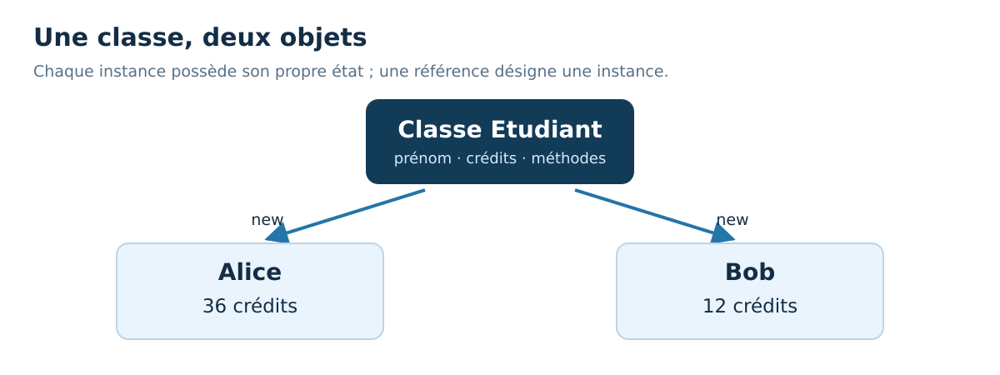

<div align="center">
<h1>☕ 30 Days Of Java : jour 14</h1>
<h3>Classes et objets</h3>
<p>Français · Java 21 · Windows &amp; VS Code</p>
</div>

[← Jour 13](../13_Day_First_Project/13_first_project.md) | [📚 Sommaire](../README.md) | [Jour 15 →](../15_Day_Constructors_and_Encapsulation/15_constructors_and_encapsulation.md)


**Durée conseillée : 60 à 90 min.** Garde au moins une heure ; prends plus de temps pour coder si nécessaire.

📍 [Objectifs](#objectifs) · [Cours](#cours) · [Exemple](#exemple) · [Exercices](#exercices) · [Bilan](#bilan)

<a id="objectifs"></a>
## 🎯 Objectifs du jour

- Différencier une classe de ses instances.
- Associer des données et des comportements.
- Comprendre les méthodes d’instance et les champs.

> **Ton rythme :** 10 min de rappel et lecture, 15–20 min sur l’exemple, 30–45 min de pratique, 5 min de bilan. Les jours de projet demandent davantage.

<a id="cours"></a>
# 📘 Cours

## Passer des valeurs séparées à un objet

Imagine deux étudiants, chacun avec un prénom et un nombre de crédits. Avec des variables indépendantes, on risque de mélanger les informations. Une **classe** définit une structure commune ; un **objet**, aussi appelé instance, représente un étudiant concret.

La classe n'est pas l'un des étudiants. Elle décrit quels champs et quelles méthodes chaque instance possède. `new Etudiant()` crée une instance. Deux appels à new créent deux objets distincts, même si leurs champs reçoivent les mêmes valeurs.



## Les champs gardent l'état d'une instance

Une variable déclarée dans la classe, en dehors des méthodes, est ici un **champ d'instance**. Chaque objet possède sa propre valeur de ce champ. `alice.credits = 30;` ne change donc pas `bob.credits`.

Contrairement aux variables locales, les champs reçoivent des valeurs par défaut : 0 pour int, false pour boolean, null pour une référence. Cela ne suffit pas à créer un objet cohérent : un étudiant sans prénom n'est pas forcément valide. Le constructeur du jour 15 résoudra ce problème.

## Une méthode agit sur l'objet qui la reçoit

`alice.ajouterCredits(6)` appelle une méthode **d'instance**. Dans cette méthode, `credits` désigne le champ de l'instance alice. Le même code appelé sur bob travaille avec les crédits de bob.

`static` a un autre sens : une méthode ou un champ static appartient à la classe plutôt qu'à une instance particulière. Main est static car Java doit pouvoir y entrer sans que nous ayons créé l'objet du programme. N'ajoute pas static partout pour faire disparaître un message d'erreur : tu risquerais de partager un état qui devrait rester propre à chaque objet.

## Référence et objet

La variable `alice` contient une référence vers l'objet. `Etudiant copie = alice;` donne une seconde référence vers **le même étudiant**. Comme pour les tableaux, ce n'est pas une duplication. Si copie modifie les crédits, le changement est visible via alice.

## Lire les fichiers du cours

Les exemples restent exécutables avec une seule commande. Le fichier contient une classe publique avec main et, quand nécessaire, une petite classe auxiliaire sans public. Une seule classe publique correspond au nom du fichier. Les noms des classes auxiliaires sont suffixés pour éviter les collisions entre journées si tu ouvres tout le dépôt dans VS Code.

Cette organisation sert à apprendre sans gestion de projet supplémentaire. Au jour 24, nous répartirons proprement les classes publiques dans plusieurs fichiers et packages.

Aujourd'hui, les champs restent accessibles pour rendre la mécanique visible. Au prochain jour, nous les protégerons : ce passage progressif est intentionnel.


<a id="exemple"></a>
## 🔎 Exemple complet, prêt à exécuter

[Ouvrir Jour14Exemple.java](./exemples/Jour14Exemple.java) · [Lire les exercices sans les réponses](./exercices/README.md)

Dans VS Code, ouvre le dossier `exemples` de cette journée, puis lance dans son terminal :

```powershell
java .\Jour14Exemple.java
```

```java
public class Jour14Exemple {
    public static void main(String[] args) {
        EtudiantJ14Exemple alice = new EtudiantJ14Exemple();
        alice.prenom = "Alice";
        alice.credits = 30;
        EtudiantJ14Exemple bob = new EtudiantJ14Exemple();
        bob.prenom = "Bob";
        bob.credits = 12;
        alice.ajouterCredits(6);
        System.out.println(alice.presentation());
        System.out.println(bob.presentation());
    }
}
class EtudiantJ14Exemple {
    String prenom;
    int credits;
    void ajouterCredits(int nombre) {
        credits += nombre;
    }
    String presentation() {
        return prenom + " : " + credits + " crédits";
    }
}
```

**Sortie du programme :**

```text
Alice : 36 crédits
Bob : 12 crédits
```

### Comprendre le déroulement

Les deux new créent deux états indépendants. L'appel ajouterCredits ne vise qu'alice. La méthode presentation ne fait pas elle-même d'affichage : elle renvoie un texte que main décide d'afficher. Cette séparation reste utile en programmation objet.


### ⚠️ Pièges fréquents

- Une classe est une définition ; un objet est une instance créée à l’exécution.
- Un champ static serait partagé par la classe, pas indépendant pour chaque étudiant.
- Affecter une référence à une autre variable ne clone pas l’objet.

<a id="exercices"></a>
## 💻 Exercices du jour

Essaie d’abord sans ouvrir les indices. Pour un exercice de code, crée ton propre fichier dans un dossier de travail et donne le même nom à la classe publique et au fichier. Les corrigés sont complets pour permettre une comparaison et une exécution indépendantes.

### Niveau 1 — comprendre et appliquer

#### Exercice 01 — Compter les objets

Deux appels à new créent a et b, puis on écrit c = a. Combien y a-t-il d’objets et de références nommées ?


<details>
<summary>💡 Voir un indice</summary>

Une affectation simple ne contient pas de new.

</details>

<details>
<summary>✅ Voir le corrigé détaillé</summary>

Il y a deux objets et trois variables de référence. a et c désignent le même objet ; b désigne l’autre.


</details>

#### Exercice 02 — Décrire un livre

Crée une classe Livre avec titre et pages, puis un objet intitulé `Java` de 240 pages. Ajoute description() qui renvoie `Java : 240 pages`.


<details>
<summary>💡 Voir un indice</summary>

La méthode d’instance peut lire les champs de son objet.

</details>

<details>
<summary>✅ Voir le corrigé détaillé</summary>

La classe regroupe les deux informations et leur présentation.


```java
public class Jour14Exercice02 {
    public static void main(String[] args) {
        LivreJ14E02 livre = new LivreJ14E02();
        livre.titre = "Java";
        livre.pages = 240;
        System.out.println(livre.description());
    }
}
class LivreJ14E02 {
    String titre;
    int pages;
    String description() {
        return titre + " : " + pages + " pages";
    }
}
```

[Ouvrir le fichier Java du corrigé](./solutions/Jour14Exercice02.java)

Résultat attendu :

```text
Java : 240 pages
```

</details>

### Niveau 2 — corriger et consolider

#### Exercice 03 — Vérifier deux états indépendants

Crée deux compteurs d’instance, incrémente le premier deux fois et le second une fois. Affiche 2 puis 1.


<details>
<summary>💡 Voir un indice</summary>

Le champ valeur ne doit pas être static.

</details>

<details>
<summary>✅ Voir le corrigé détaillé</summary>

Chaque new fournit son propre champ valeur initialisé à zéro.


```java
public class Jour14Exercice03 {
    public static void main(String[] args) {
        CompteurJ14E03 a = new CompteurJ14E03();
        CompteurJ14E03 b = new CompteurJ14E03();
        a.incrementer();
        a.incrementer();
        b.incrementer();
        System.out.println(a.valeur);
        System.out.println(b.valeur);
    }
}
class CompteurJ14E03 {
    int valeur;
    void incrementer() {
        valeur++;
    }
}
```

[Ouvrir le fichier Java du corrigé](./solutions/Jour14Exercice03.java)

Résultat attendu :

```text
2
1
```

</details>

### Niveau 3 — résoudre un petit problème

#### Exercice 04 — Expérimenter un alias

Crée un compteur, affecte-le à une seconde variable, incrémente via cette seconde variable, puis affiche la valeur via la première. Explique le résultat.


<details>
<summary>💡 Voir un indice</summary>

Les deux variables pointent vers le même objet.

</details>

<details>
<summary>✅ Voir le corrigé détaillé</summary>

Le résultat 1 démontre le partage de l’objet. Il ne montre pas que toutes les instances de Compteur partagent leur champ.


```java
public class Jour14Exercice04 {
    public static void main(String[] args) {
        CompteurJ14E04 premier = new CompteurJ14E04();
        CompteurJ14E04 alias = premier;
        alias.incrementer();
        System.out.println(premier.valeur);
    }
}
class CompteurJ14E04 {
    int valeur;
    void incrementer() {
        valeur++;
    }
}
```

[Ouvrir le fichier Java du corrigé](./solutions/Jour14Exercice04.java)

Résultat attendu :

```text
1
```

</details>

<a id="bilan"></a>
## ✅ Avant de passer à la suite

- [ ] Je peux différencier une classe de ses instances.
- [ ] Je peux associer des données et des comportements.
- [ ] Je peux comprendre les méthodes d’instance et les champs.

- [ ] J’ai tenté les quatre exercices avant de comparer aux corrigés.
- [ ] Je peux expliquer une erreur rencontrée et la façon dont je l’ai corrigée.

[Noter ma progression](../PROGRESSION.md) · [Consulter le glossaire](../docs/GLOSSAIRE.md)

---

[← Jour 13](../13_Day_First_Project/13_first_project.md) | [📚 Sommaire](../README.md) | [Jour 15 →](../15_Day_Constructors_and_Encapsulation/15_constructors_and_encapsulation.md)

**☕ Une étape comprise vaut mieux qu’une journée cochée trop vite.**
