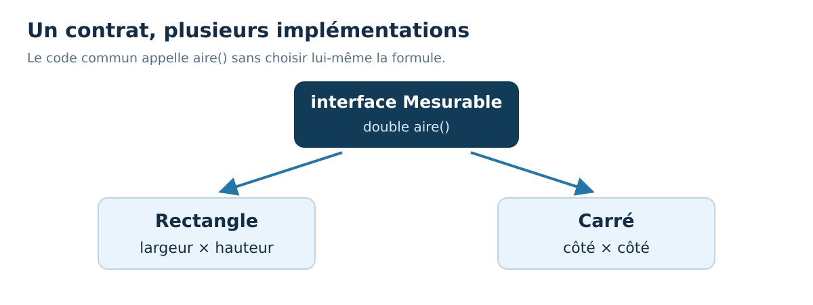

<div align="center">
<h1>☕ 30 Days Of Java : jour 18</h1>
<h3>Interfaces et polymorphisme</h3>
<p>Français · Java 21 · Windows &amp; VS Code</p>
</div>

[← Jour 17](../17_Day_Inheritance/17_inheritance.md) | [📚 Sommaire](../README.md) | [Jour 19 →](../19_Day_Equality_and_Immutability/19_equality_and_immutability.md)


**Durée conseillée : 60 à 90 min.** Garde au moins une heure ; prends plus de temps pour coder si nécessaire.

📍 [Objectifs](#objectifs) · [Cours](#cours) · [Exemple](#exemple) · [Exercices](#exercices) · [Bilan](#bilan)

<a id="objectifs"></a>
## 🎯 Objectifs du jour

- Définir un contrat avec interface.
- Implémenter un même contrat de plusieurs façons.
- Programmer une méthode sans dépendre d’une classe concrète.

> **Ton rythme :** 10 min de rappel et lecture, 15–20 min sur l’exemple, 30–45 min de pratique, 5 min de bilan. Les jours de projet demandent davantage.

<a id="cours"></a>
# 📘 Cours

## Décrire une capacité commune

Une interface décrit un contrat que des classes peuvent respecter. `interface Mesurable { double aire(); }` demande ici une méthode aire. Un Rectangle et un Cercle peuvent fournir cette capacité, même si leurs calculs et leurs champs diffèrent.

La classe écrit `implements Mesurable`, puis fournit une implémentation de la méthode. Une méthode abstraite d'interface ordinaire comme celle-ci est implicitement public. La classe doit donc la rendre **public** elle aussi ; on ne peut pas réduire sa visibilité.

## Programmer contre le contrat

Une méthode `afficherAire(Mesurable forme)` ne dépend ni de Rectangle ni de Cercle. Elle appelle seulement aire, garanti par le contrat. Ajouter une autre forme ne demande pas de modifier cette méthode.

C'est le **polymorphisme** : un même appel décrit par un type commun peut produire des comportements adaptés à des objets différents. Il ne s'agit pas de deviner leur classe avec une longue liste de if. Le choix est porté par les implémentations.



## Interface ou classe abstraite ?

| Outil | Usage typique |
| --- | --- |
| Interface | Exprimer une capacité ou un contrat que plusieurs types peuvent respecter. |
| Classe abstraite | Partager une base de classe avec état et comportements communs, tout en laissant certaines méthodes à compléter. |
| Classe concrète | Fournir une implémentation instanciable. |

Une classe abstraite se déclare avec `abstract` et ne peut pas être créée directement avec new. Une interface n'est pas non plus directement instanciable sous sa forme simple. Tu crées un objet d'une classe concrète qui respecte le contrat.

Une classe peut implémenter plusieurs interfaces, mais n'étendre qu'une classe. Les interfaces modernes peuvent aussi fournir des méthodes default et static ; nous restons aujourd'hui sur un contrat minimal pour comprendre la séparation.

## Un exemple proche des études

Une application peut accepter plusieurs façons de calculer un score, de présenter une notification ou de stocker des données. Si elle dépend d'une interface stable, elle peut changer une implémentation sans réécrire les règles principales.

Cette liberté exige un contrat précis : quelle unité renvoie aire ? Les dimensions négatives sont-elles autorisées ? Est-ce que notifier envoie réellement un message ou construit seulement un texte ? Pour les exercices, les notifications sont uniquement des chaînes affichées localement, sans envoi externe.

Le mot interface ne désigne donc pas ici un écran ou une fenêtre. Il désigne une frontière de programmation entre ce qu'on promet et la manière dont on le réalise.


<a id="exemple"></a>
## 🔎 Exemple complet, prêt à exécuter

[Ouvrir Jour18Exemple.java](./exemples/Jour18Exemple.java) · [Lire les exercices sans les réponses](./exercices/README.md)

Dans VS Code, ouvre le dossier `exemples` de cette journée, puis lance dans son terminal :

```powershell
java .\Jour18Exemple.java
```

```java
public class Jour18Exemple {
    static void afficherAire(MesurableJ18Exemple forme) {
        System.out.println(forme.aire());
    }
    public static void main(String[] args) {
        afficherAire(new RectangleJ18Exemple(3, 4));
        afficherAire(new CarreJ18Exemple(5));
    }
}
interface MesurableJ18Exemple {
    double aire();
}
class RectangleJ18Exemple implements MesurableJ18Exemple {
    private final double largeur;
    private final double hauteur;
    RectangleJ18Exemple(double largeur, double hauteur) {
        this.largeur = largeur;
        this.hauteur = hauteur;
    }
    @Override public double aire() { return largeur * hauteur; }
}
class CarreJ18Exemple implements MesurableJ18Exemple {
    private final double cote;
    CarreJ18Exemple(double cote) { this.cote = cote; }
    @Override public double aire() { return cote * cote; }
}
```

**Sortie du programme :**

```text
12.0
25.0
```

### Comprendre le déroulement

afficherAire ne connaît que Mesurable. Chaque new fournit une instance concrète. Les deux classes sont indépendantes dans cet exemple : Carre n'hérite pas de Rectangle, ce qui évite de créer une hiérarchie inutile juste pour réutiliser une multiplication.


### ⚠️ Pièges fréquents

- Une implémentation de méthode d’interface doit respecter sa visibilité public.
- Interface désigne ici un contrat de code, pas une interface graphique.
- L’ajout d’un type ne devrait pas obliger le code commun à connaître tous ses détails.

<a id="exercices"></a>
## 💻 Exercices du jour

Essaie d’abord sans ouvrir les indices. Pour un exercice de code, crée ton propre fichier dans un dossier de travail et donne le même nom à la classe publique et au fichier. Les corrigés sont complets pour permettre une comparaison et une exécution indépendantes.

### Niveau 1 — comprendre et appliquer

#### Exercice 01 — Identifier le contrat

Une méthode reçoit une variable de type Mesurable. Peut-elle appeler aire() ? Peut-elle appeler directement une méthode propre à Rectangle absente de Mesurable ?


<details>
<summary>💡 Voir un indice</summary>

Le type déclaré détermine ce que le compilateur garantit.

</details>

<details>
<summary>✅ Voir le corrigé détaillé</summary>

Elle peut appeler aire(). Elle ne peut pas appeler directement une méthode absente du contrat Mesurable, même si l’objet réel est parfois un Rectangle.


</details>

#### Exercice 02 — Implémenter un score

Crée interface Notable avec int score(), puis Devoir qui renvoie 15. Affiche le score via une variable Notable.


<details>
<summary>💡 Voir un indice</summary>

La méthode implémentée doit être public.

</details>

<details>
<summary>✅ Voir le corrigé détaillé</summary>

Le contrat peut être utilisé sans connaître le détail du devoir.


```java
public class Jour18Exercice02 {
    public static void main(String[] args) {
        NotableJ18E02 travail = new DevoirJ18E02();
        System.out.println(travail.score());
    }
}
interface NotableJ18E02 { int score(); }
class DevoirJ18E02 implements NotableJ18E02 {
    @Override public int score() { return 15; }
}
```

[Ouvrir le fichier Java du corrigé](./solutions/Jour18Exercice02.java)

Résultat attendu :

```text
15
```

</details>

### Niveau 2 — corriger et consolider

#### Exercice 03 — Une seconde forme

Ajoute une classe Triangle(base, hauteur) respectant Mesurable. Avec 6 et 4, aire() doit renvoyer 12.0.


<details>
<summary>💡 Voir un indice</summary>

L’aire du triangle est base × hauteur / 2.

</details>

<details>
<summary>✅ Voir le corrigé détaillé</summary>

La division reste décimale grâce aux champs double.


```java
public class Jour18Exercice03 {
    public static void main(String[] args) {
        MesurableJ18E03 forme = new TriangleJ18E03(6, 4);
        System.out.println(forme.aire());
    }
}
interface MesurableJ18E03 { double aire(); }
class TriangleJ18E03 implements MesurableJ18E03 {
    private final double base;
    private final double hauteur;
    TriangleJ18E03(double base, double hauteur) {
        this.base = base;
        this.hauteur = hauteur;
    }
    @Override public double aire() { return base * hauteur / 2.0; }
}
```

[Ouvrir le fichier Java du corrigé](./solutions/Jour18Exercice03.java)

Résultat attendu :

```text
12.0
```

</details>

### Niveau 3 — résoudre un petit problème

#### Exercice 04 — Changer la présentation sans changer l’appelant

Crée Formateur avec formater(String texte), puis Normal et Majuscules. Une méthode afficher(Formateur, String) affiche le résultat. Teste les deux avec `Java`.


<details>
<summary>💡 Voir un indice</summary>

Le formatage est délégué à l’objet passé en paramètre.

</details>

<details>
<summary>✅ Voir le corrigé détaillé</summary>

Le code commun ne contient aucun test du type concret ; changer d’objet change la stratégie.


```java
import java.util.Locale;
public class Jour18Exercice04 {
    static void afficher(FormateurJ18E04 formateur, String texte) {
        System.out.println(formateur.formater(texte));
    }
    public static void main(String[] args) {
        afficher(new NormalJ18E04(), "Java");
        afficher(new MajusculesJ18E04(), "Java");
    }
}
interface FormateurJ18E04 { String formater(String texte); }
class NormalJ18E04 implements FormateurJ18E04 {
    @Override public String formater(String texte) { return texte; }
}
class MajusculesJ18E04 implements FormateurJ18E04 {
    @Override public String formater(String texte) { return texte.toUpperCase(Locale.ROOT); }
}
```

[Ouvrir le fichier Java du corrigé](./solutions/Jour18Exercice04.java)

Résultat attendu :

```text
Java
JAVA
```

</details>

<a id="bilan"></a>
## ✅ Avant de passer à la suite

- [ ] Je peux définir un contrat avec interface.
- [ ] Je peux implémenter un même contrat de plusieurs façons.
- [ ] Je peux programmer une méthode sans dépendre d’une classe concrète.

- [ ] J’ai tenté les quatre exercices avant de comparer aux corrigés.
- [ ] Je peux expliquer une erreur rencontrée et la façon dont je l’ai corrigée.

[Noter ma progression](../PROGRESSION.md) · [Consulter le glossaire](../docs/GLOSSAIRE.md)

---

[← Jour 17](../17_Day_Inheritance/17_inheritance.md) | [📚 Sommaire](../README.md) | [Jour 19 →](../19_Day_Equality_and_Immutability/19_equality_and_immutability.md)

**☕ Une étape comprise vaut mieux qu’une journée cochée trop vite.**
