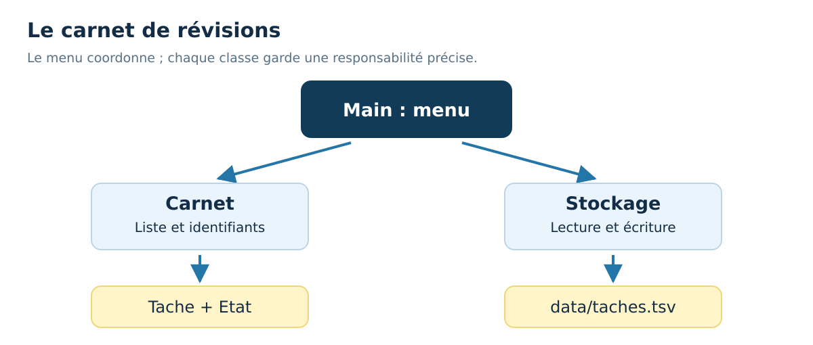

<div align="center">
<h1>☕ 30 Days Of Java : jour 29</h1>
<h3>Projet final : carnet de révisions</h3>
<p>Français · Java 21 · Windows &amp; VS Code</p>
</div>

[← Jour 28](../28_Day_Automated_Tests/28_automated_tests.md) | [📚 Sommaire](../README.md) | [Jour 30 →](../30_Day_Conclusion/30_conclusion.md)


**Durée conseillée : 120 à 180 min, à répartir en plusieurs séances.** Garde au moins une heure ; prends plus de temps pour coder si nécessaire.

📍 [Objectifs](#objectifs) · [Cours](#cours) · [Exemple](#exemple) · [Exercices](#exercices) · [Bilan](#bilan)

<a id="objectifs"></a>
## 🎯 Objectifs du jour

- Assembler un menu, un modèle, une collection et un stockage.
- Faire respecter les règles malgré des saisies ou fichiers invalides.
- Compiler, utiliser et expliquer un projet à plusieurs fichiers.

> **Ton rythme :** 10 min de rappel et lecture, 15–20 min sur l’exemple, 30–45 min de pratique, 5 min de bilan. Les jours de projet demandent davantage.

<a id="cours"></a>
# 📘 Cours

## Ce que tu vas construire

Le carnet de révisions gère des tâches avec un identifiant, un titre, une échéance et un état. Dans un menu au terminal, tu peux ajouter une tâche, afficher les tâches, terminer une tâche et afficher celles en retard. Les modifications sont enregistrées dans un fichier, puis retrouvées au prochain lancement.

Commence par le [sujet détaillé](./projet/SUJET.md). Le [guide du projet](./projet/README.md) explique comment compiler et lancer sous Windows. Le [code complet](./projet/src/fr/cours/revisions/Main.java) est un corrigé à consulter après ta première tentative, ou morceau par morceau si tu préfères être guidé.

## Une construction en étapes

1. Écris Etat et Tache. Teste la validation du titre, la règle de retard et le passage à l'état terminé.
2. Écris Carnet pour garder les tâches, attribuer les identifiants et retrouver une tâche à terminer.
3. Commence le menu avec des données seulement en mémoire. Réutilise un seul Scanner et des lectures de lignes.
4. Ajoute Stockage : écrire un format stable, relire toutes les lignes et signaler une donnée invalide avec son numéro de ligne.
5. Relie les modifications à la sauvegarde, puis teste un redémarrage complet.

Les quatre premières étapes suffisent à un premier prototype. Répartis cette journée sur plusieurs séances d'une heure si nécessaire. Le résultat sera plus utile si tu peux expliquer le code que si tu parcours tous les fichiers en une seule fois.

## Les responsabilités du corrigé

| Fichier | Ce qu'il fait |
| --- | --- |
| Etat.java | Déclare A_FAIRE et TERMINEE. |
| Tache.java | Vérifie et représente une tâche immuable. |
| Carnet.java | Gère les identifiants, la liste et les changements d'état. |
| Stockage.java | Lit et écrit le format tabulé UTF-8. |
| Main.java | Dialogue avec l'utilisateur et orchestre les opérations. |



## Éviter un faux succès de sauvegarde

Le corrigé prépare une copie du carnet avant une modification. Il sauvegarde cette copie, puis la retient comme nouvel état seulement si l'écriture a réussi. Ainsi, un message de succès correspond à une modification effectivement enregistrée.

L'écriture passe par un fichier temporaire voisin, puis un déplacement vers le fichier final. Le programme tente un déplacement atomique, c'est-à-dire un remplacement en une opération, et prévoit le cas où ce mode n'est pas disponible. Cela réduit le risque d'un fichier partiellement réécrit ; ce petit projet n'est toutefois pas une base de données multi-utilisateur.

## Ne pas écraser un fichier qu'on ne comprend pas

Un fichier absent signifie un premier démarrage avec un carnet vide. Un fichier existant mais invalide ou inaccessible provoque un message et l'arrêt du chargement. Le programme ne remplace pas alors le contenu par un carnet vide. Cette différence est essentielle pour préserver les données déjà présentes.

Le format refuse les tabulations et retours à la ligne dans un titre. Ce choix simplifie le fichier et est indiqué à l'utilisateur. Un format libre demanderait un mécanisme d'échappement ou une bibliothèque de sérialisation.

## Ta vérification de fin de journée

Ajoute une tâche, ferme, relance, vérifie sa présence. Termine-la et recommence. Essaie une date impossible, un titre vide et un identifiant inconnu. Lance ensuite les tests du projet indiqués dans son guide. Le petit exemple ci-dessous isole seulement le modèle : le dossier projet contient l'application complète.


<a id="exemple"></a>
## 🔎 Exemple complet, prêt à exécuter

[Ouvrir Jour29Exemple.java](./exemples/Jour29Exemple.java) · [Lire les exercices sans les réponses](./exercices/README.md)

Dans VS Code, ouvre le dossier `exemples` de cette journée, puis lance dans son terminal :

```powershell
java .\Jour29Exemple.java
```

```java
import java.time.LocalDate;
public class Jour29Exemple {
    public static void main(String[] args) {
        TacheJ29Exemple tache = new TacheJ29Exemple(1, "Réviser les tableaux", LocalDate.of(2026, 9, 20), false);
        TacheJ29Exemple terminee = tache.terminer();
        System.out.println(tache.titre());
        System.out.println(tache.terminee());
        System.out.println(terminee.terminee());
    }
}
record TacheJ29Exemple(int id, String titre, LocalDate echeance, boolean terminee) {
    TacheJ29Exemple terminer() { return new TacheJ29Exemple(id, titre, echeance, true); }
}
```

**Sortie du programme :**

```text
Réviser les tableaux
false
true
```

### Comprendre le déroulement

La version réduite montre l'immuabilité : terminer renvoie une nouvelle valeur et ne modifie pas la tâche d'origine. Le modèle du projet complet ajoute la validation et un enum Etat. Le Carnet remplace l'ancienne valeur par la nouvelle au bon indice ; appeler terminer sans conserver son retour ne suffirait pas.


### ⚠️ Pièges fréquents

- Ne confirme pas une sauvegarde avant de savoir qu’elle a réussi.
- Une entrée invalide ne doit pas détruire les tâches déjà chargées.
- Avec un objet immuable, il faut conserver la nouvelle valeur produite par une modification.

<a id="exercices"></a>
## 💻 Exercices du jour

Essaie d’abord sans ouvrir les indices. Pour un exercice de code, crée ton propre fichier dans un dossier de travail et donne le même nom à la classe publique et au fichier. Les corrigés sont complets pour permettre une comparaison et une exécution indépendantes.

### Niveau 1 — comprendre et appliquer

#### Exercice 01 — Attribuer les responsabilités

Où placer la règle du titre non vide, la conversion des lignes d’un fichier et la question affichée à l’utilisateur ?


<details>
<summary>💡 Voir un indice</summary>

Sépare modèle, stockage et dialogue.

</details>

<details>
<summary>✅ Voir le corrigé détaillé</summary>

La règle du titre appartient au modèle Tache. La conversion du fichier appartient au stockage. La question et le message de correction appartiennent au menu.


</details>

#### Exercice 02 — Nettoyer un titre

Écris nettoyerTitre(String titre), qui refuse null ou un texte blanc, sinon renvoie le texte nettoyé. Teste ` Réviser Java `.


<details>
<summary>💡 Voir un indice</summary>

Valide l’absence, puis strip, puis le contenu restant.

</details>

<details>
<summary>✅ Voir le corrigé détaillé</summary>

Le titre conservé ne contient pas les espaces extérieurs accidentels.


```java
public class Jour29Exercice02 {
    static String nettoyerTitre(String titre) {
        if (titre == null || titre.isBlank()) throw new IllegalArgumentException("Titre requis");
        return titre.strip();
    }
    public static void main(String[] args) {
        System.out.println(nettoyerTitre(" Réviser Java "));
    }
}
```

[Ouvrir le fichier Java du corrigé](./solutions/Jour29Exercice02.java)

Résultat attendu :

```text
Réviser Java
```

</details>

### Niveau 2 — corriger et consolider

#### Exercice 03 — Conserver une modification immuable

Dans une ArrayList contenant une tâche non terminée, remplace la tâche par le résultat de terminer(). Affiche son nouvel état.


<details>
<summary>💡 Voir un indice</summary>

Le retour doit être réinséré avec set.

</details>

<details>
<summary>✅ Voir le corrigé détaillé</summary>

L’objet initial reste inchangé, mais la liste contient désormais la nouvelle valeur.


```java
import java.util.ArrayList;
import java.util.List;
public class Jour29Exercice03 {
    public static void main(String[] args) {
        List<TacheJ29E03> taches = new ArrayList<>(List.of(new TacheJ29E03("Java", false)));
        taches.set(0, taches.get(0).terminer());
        System.out.println(taches.get(0).terminee());
    }
}
record TacheJ29E03(String titre, boolean terminee) {
    TacheJ29E03 terminer() { return new TacheJ29E03(titre, true); }
}
```

[Ouvrir le fichier Java du corrigé](./solutions/Jour29Exercice03.java)

Résultat attendu :

```text
true
```

</details>

### Niveau 3 — résoudre un petit problème

#### Exercice 04 — Chercher une tâche sans confondre position et identifiant

Dans une liste de tâches d’identifiants 3 et 8, écris indiceParId. Pour 8, renvoie 1 ; pour 1, renvoie −1.


<details>
<summary>💡 Voir un indice</summary>

L’identifiant est une donnée métier, pas nécessairement l’indice de la liste.

</details>

<details>
<summary>✅ Voir le corrigé détaillé</summary>

La recherche compare le champ id de chaque tâche. Lire directement la case 8 serait incorrect.


```java
import java.util.List;
public class Jour29Exercice04 {
    static int indiceParId(List<TacheJ29E04> taches, int id) {
        for (int i = 0; i < taches.size(); i++) {
            if (taches.get(i).id() == id) return i;
        }
        return -1;
    }
    public static void main(String[] args) {
        List<TacheJ29E04> taches = List.of(new TacheJ29E04(3, "Java"), new TacheJ29E04(8, "Maths"));
        System.out.println(indiceParId(taches, 8));
        System.out.println(indiceParId(taches, 1));
    }
}
record TacheJ29E04(int id, String titre) {}
```

[Ouvrir le fichier Java du corrigé](./solutions/Jour29Exercice04.java)

Résultat attendu :

```text
1
-1
```

</details>

<a id="bilan"></a>
## ✅ Avant de passer à la suite

- [ ] Je peux assembler un menu, un modèle, une collection et un stockage.
- [ ] Je peux faire respecter les règles malgré des saisies ou fichiers invalides.
- [ ] Je peux compiler, utiliser et expliquer un projet à plusieurs fichiers.

- [ ] J’ai tenté les quatre exercices avant de comparer aux corrigés.
- [ ] Je peux expliquer une erreur rencontrée et la façon dont je l’ai corrigée.

[Noter ma progression](../PROGRESSION.md) · [Consulter le glossaire](../docs/GLOSSAIRE.md)

---

[← Jour 28](../28_Day_Automated_Tests/28_automated_tests.md) | [📚 Sommaire](../README.md) | [Jour 30 →](../30_Day_Conclusion/30_conclusion.md)

**☕ Une étape comprise vaut mieux qu’une journée cochée trop vite.**
